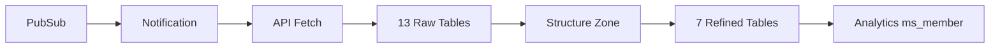

# Instructions
# 📚 Development Guide & Module Requirements

## 1. Core Framework Modules

### 1.1 Pipeline Orchestrator Module
**Objective:** จัดการ pipeline orchestration และ window management

**Requirements:**
```yaml
functional:
  - Support 5 processing windows (1s, 60s, 60s, 300s, 300s)
  - Handle late data with configurable allowed lateness
  - Support early/on-time/late firing triggers
  - Coordinate cross-zone dependencies

technical:
  - Apache Beam Window API integration
  - State management for deduplication
  - Watermark tracking
  - Trigger configuration per zone

acceptance_criteria:
  - Process 10M records/second
  - Late data handling up to 10 minutes
  - Zero data loss during window transitions
```

### 1.2 CDC Detection Module
**Objective:** Detect และจัดการ change types (INSERT/UPDATE/DELETE)

**Requirements:**
```yaml
functional:
  - Detect CDC operations from event metadata
  - Compare with existing data for operation determination
  - Support full-dump, incremental, and upsert patterns
  - Handle out-of-order events

technical:
  - In-memory cache for recent records
  - BigQuery lookup for historical data
  - Operation inference logic
  - Timestamp-based ordering

implementation_checklist:
  - [ ] CDCDetector class with operation detection
  - [ ] CDCCache for performance optimization
  - [ ] CDCState management
  - [ ] Operation validation logic
```

### 1.3 Reconciliation Engine Module
**Objective:** Reconcile data between GCP และ AWS S3

**Requirements:**
```yaml
functional:
  - Row-level comparison GCP vs S3
  - Schema mapping between platforms
  - Mismatch detection and reporting
  - Support for different file formats (Parquet, JSON)

technical:
  - S3 client integration (AWS SDK v2)
  - Parallel processing for large datasets
  - Configurable mapping rules
  - Audit trail generation

performance:
  - Process 1TB snapshots in < 5 minutes
  - Memory efficient streaming comparison
  - Batch processing for S3 reads

implementation_checklist:
  - [ ] ReconciliationEngine with comparison logic
  - [ ] SchemaMapper for field mapping
  - [ ] S3SnapshotReader for data access
  - [ ] ReconciliationAuditor for reporting
```

### 1.4 Quality Engine Module
**Objective:** Data quality validation และ monitoring

**Requirements:**
```yaml
functional:
  - Completeness checks (required fields)
  - Validity checks (format, range, enum)
  - Uniqueness validation
  - Consistency rules
  - Timeliness monitoring

technical:
  - Rule-based engine with YAML configuration
  - Custom rule support via expressions
  - Quality score calculation
  - Threshold-based alerting

quality_rules:
  default:
    - NOT_NULL checks
    - Data type validation
    - Range validation
  custom:
    - Business logic rules
    - Cross-field validation
    - Aggregate checks

implementation_checklist:
  - [ ] QualityEngine main processor
  - [ ] RuleEngine for rule execution
  - [ ] QualityScorer for metrics
  - [ ] QualityAuditor for reporting
```

## 2. Domain Pipeline Requirements

### 2.1 Member Pipeline
**Objective:** Process member data through all zones

**Data Flow:**


**Processing Requirements:**
```yaml
raw_zone:
  tables: 13
  ingestion: incremental
  window: 60s
  operations:
    - API data fetch
    - Field extraction
    - Type preservation
    - Partition by date

structure_zone:
  tables: 13
  window: 60s
  operations:
    - Type conversion
    - Schema alignment
    - Null handling

refined_zone:
  tables: 7
  window: 300s
  operations:
    - Business logic transformation
    - Member profile aggregation
    - Address geocoding
    - Consent management
    - Communication preferences

analytics_zone:
  tables: 1 (ms_member)
  window: 300s
  operations:
    - Feature engineering
    - Segmentation
    - ML feature generation
    - Engagement scoring
```

## 3. Infrastructure & Deployment

### 3.1 Terraform Requirements
```yaml
resources:
  compute:
    - Dataflow jobs (10-50 workers)
    - Worker type: n1-highmem-4
    - Streaming engine enabled
  
  storage:
    - BigQuery datasets (raw, structure, refined, analytics)
    - GCS buckets (staging, temp, audit, reconciliation)
    - Retention policies per zone
  
  messaging:
    - PubSub topics and subscriptions
    - Dead letter queues
    
  monitoring:
    - Cloud Monitoring dashboards
    - Alert policies
    - Log sinks
```

### 3.2 Configuration Management
```yaml
environments:
  dev:
    workers: 2-5
    allowed_lateness: 30m
    reconciliation: disabled
    
  staging:
    workers: 5-20
    allowed_lateness: 10m
    reconciliation: enabled
    
  production:
    workers: 10-50
    allowed_lateness: 5m
    reconciliation: enabled
    auto_scaling: true
```

## 4. Testing Requirements

### 4.1 Unit Testing
```scala
// Example test structure
class CDCDetectorSpec extends FlatSpec {
  "CDCDetector" should "detect INSERT for new records" in {
    val detector = new CDCDetector()
    val result = detector.detectOperation(newRecord, None)
    assert(result == CDCOperation.Insert)
  }
  
  it should "detect UPDATE for existing records" in {
    val detector = new CDCDetector()
    val result = detector.detectOperation(record, Some(existingRecord))
    assert(result == CDCOperation.Update)
  }
}
```

### 4.2 Integration Testing
```yaml
test_scenarios:
  - Full pipeline end-to-end
  - Reconciliation accuracy
  - Quality rule validation
  - Window processing
  - Late data handling
  - Error recovery
```

---

# 📋 Project Memory Document

## Project Overview

### Project Name
**Real-time CDC Pipeline Framework**

### Purpose
Build a reusable, scalable framework for real-time Change Data Capture (CDC) pipelines on Google Cloud Dataflow, processing data through multiple zones (Raw → Structure → Refined → Analytics) with parallel reconciliation against AWS S3.

### Key Technologies
- **Language:** Scala 2.12
- **Framework:** Apache Beam 2.58.0
- **Runtime:** Google Cloud Dataflow
- **Storage:** BigQuery, GCS, AWS S3
- **Messaging:** Google Pub/Sub

## Architecture Summary

### Core Design Principles
1. **Zone-based Processing:** 4-zone architecture (Raw, Structure, Refined, Analytics)
2. **Window-based Streaming:** 5 processing windows with different durations
3. **Parallel Reconciliation:** Continuous validation against AWS reference
4. **Quality-First:** Built-in DQ checks at every stage
5. **Audit Everything:** Comprehensive audit trail

### Processing Flow
```
Pub/Sub → Notification (1s window)
  ↓
API Fetch → Raw Zone (60s window)
  ↓
Type Conversion → Structure Zone (60s window)  
  ↓
Business Logic → Refined Zone (300s window)
  ↓
Aggregation → Analytics Zone (300s window)

[Parallel: Reconciliation + Quality + Audit at each zone]
```

### Key Components

#### Framework Layer
- **BaseDoFn:** Foundation for all processors
- **BaseProcessor:** Common processing logic
- **BasePipeline:** Pipeline template
- **BaseConnector:** Connection management

#### Processing Modules
- **NotificationProcessor:** Pub/Sub message handling
- **CDCProcessor:** Change detection
- **ReconciliationEngine:** Cross-platform validation
- **QualityEngine:** Data quality validation
- **AuditEngine:** Audit trail management

#### Data Models
- **Events:** NotificationEvent, CDCEvent, PipelineEvent
- **Records:** FetchedData, CDCRecord, ProcessedRecord
- **Results:** ReconciliationResult, QualityResult, AuditResult
- **Errors:** Typed error hierarchy with retry logic

### Performance Characteristics
- **Throughput:** 10M+ records/second
- **Latency:** < 1 second for notification processing
- **Scalability:** 10-50 workers auto-scaling
- **Reliability:** At-least-once delivery guarantee

## Current State vs Target State

### Current State (GitHub Repo)
- Basic framework scaffold
- Stub implementations
- Single-window processing
- Basic reconciliation

### Target State (Documentation)
- Full CDC implementation
- 5-window processing
- Complete reconciliation engine
- Production-ready quality checks
- Comprehensive audit system

## Implementation Roadmap

### Phase 1: Core Framework (Weeks 1-2)
- [ ] Implement BaseDoFn hierarchy
- [ ] Build PipelineOrchestrator
- [ ] Create WindowManager
- [ ] Setup basic connectors

### Phase 2: CDC & Processing (Weeks 3-4)
- [ ] CDCDetector implementation
- [ ] Incremental processing logic
- [ ] State management
- [ ] Error handling

### Phase 3: Reconciliation (Weeks 5-6)
- [ ] ReconciliationEngine
- [ ] S3 integration
- [ ] Schema mapping
- [ ] Mismatch reporting

### Phase 4: Quality & Audit (Weeks 7-8)
- [ ] QualityEngine
- [ ] Rule framework
- [ ] AuditLogger
- [ ] Monitoring integration

### Phase 5: Domain Implementation (Weeks 9-10)
- [ ] Member pipeline
- [ ] Transformations
- [ ] Testing
- [ ] Documentation

## Configuration Examples

### Pipeline Configuration
```yaml
pipeline:
  name: "member-cdc-pipeline"
  streaming: true
  windows:
    - stage: notification
      duration: 1s
      trigger: AfterWatermark
    - stage: raw
      duration: 60s
      trigger: AfterWatermark + EarlyFiring
    - stage: refined
      duration: 300s
      allowed_lateness: 10m
```

### Quality Rules
```yaml
quality:
  rules:
    - type: NOT_NULL
      fields: [member_id, email]
    - type: RANGE
      field: age
      min: 0
      max: 120
    - type: PATTERN
      field: email
      regex: "^[a-zA-Z0-9._%+-]+@[a-zA-Z0-9.-]+\\.[a-zA-Z]{2,}$"
```

## Key Decisions & Rationale

1. **Scala over Java:** Better functional programming support for stream processing
2. **5-Window Strategy:** Balance between latency and efficiency
3. **Zone Architecture:** Clear separation of concerns and data quality stages
4. **Parallel Reconciliation:** Continuous validation without blocking main pipeline
5. **YAML Configuration:** Flexibility without recompilation

## Known Issues & Limitations

1. **Current Repo:** Stub implementations need completion
2. **S3 Integration:** AWS credentials management needs Secret Manager
3. **Schema Evolution:** No automatic schema migration yet
4. **Testing:** Integration tests need cloud resources

## Next Steps

1. Complete core framework implementation
2. Add comprehensive unit tests
3. Implement member domain pipeline
4. Setup CI/CD pipeline
5. Performance testing and optimization
6. Production deployment

## Resources & References

- [Apache Beam Documentation](https://beam.apache.org/)
- [Google Dataflow Best Practices](https://cloud.google.com/dataflow/docs/guides)
- [BigQuery Streaming](https://cloud.google.com/bigquery/streaming-data-into-bigquery)
- Internal Design Doc: `Complete CDC Pipeline Solution Documentation.md`

---

These documents provide a comprehensive guide for continuing development. The first document focuses on implementation requirements, while the second serves as project memory. Both can be used with AI coding assistants to maintain consistency and accelerate development.